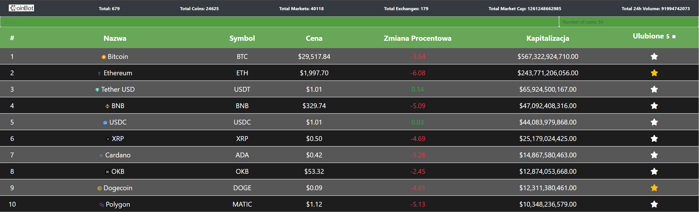
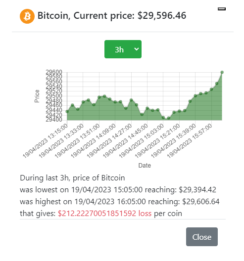

# Web-crypto-app

This is a simple web application that displays information about 50 popular cryptocurrencies in real-time. The application uses the Coinranking API to fetch data about the cryptocurrencies and displays it in a table format. Users can also select a specific cryptocurrency to view more detailed information, including a price chart and market capitalization. User can also mark specific cryptocurrency as favourite, and display only selected currency.

# Features
* Displays real-time data about different cryptocurrencies.
* Provides a search bar to filter and search cryptocurrencies by name or symbol.
* Provides sorting by the cryptocurrency name or price.
* Allows users to select a specific cryptocurrency to view more detailed information.
* Allows user to select favourite cryptocurrency and display only selected amount, data are stored in the localstorage.
* Displays a price chart and market capitalization of the selected cryptocurrency.

# Preview
Main Window preview

Details preview

  

# Technologies Used
* HTML
* CSS
* JavaScript
* Bootstrap
* Chart.js

# Installation

* Clone the repository to your local machine.
* ``git clone https://github.com/FoRoKo1o/Web-crypto-app``
* Open the index.html file in your browser.

# Usage
 1. Open the index.html file in your browser.
 2. The table on the main page displays real-time data about different cryptocurrencies.
 3. Use the search bar to filter and search cryptocurrencies by name or symbol.
 4. Click on a specific cryptocurrency to view more detailed information.
 5. The modal window will display a price chart and market capitalization of the selected cryptocurrency.

# Credits
* Coinranking API: https://rapidapi.com/Coinranking/api/coinranking1/
* Bootstrap: https://getbootstrap.com/
* Chart.js: https://www.chartjs.org/
